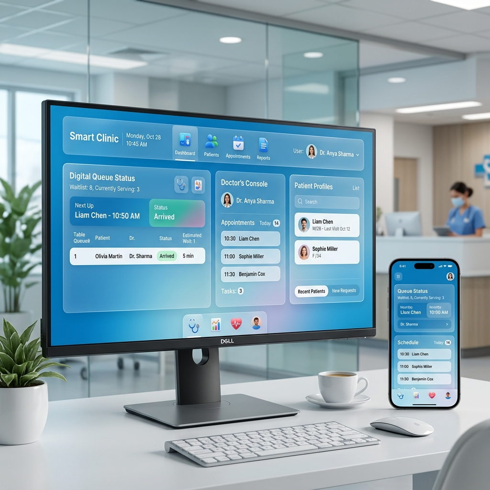

# 🏥 SmartClinic - Modern Clinic Management System

**SmartClinic** is a premium, real-time medical queue management solution designed to streamline the patient experience and healthcare workflows. Built with a focus on speed, reliability, and modern aesthetics, it provides a seamless bridge between patients, receptionists, and doctors.



## ✨ Key Features

*   **📱 Patient Portal**: Self-service token booking and real-time queue position tracking.
*   **📋 Reception Dashboard**: Centralized management for walk-ins, patient registration, and lobby monitoring.
*   **🩺 Doctor Console**: Dedicated interfaces for different specialties (Cardiology, Pediatrics, Orthopedics) to call patients in FIFO order.
*   **📺 TV Display**: A full-screen, high-refresh-rate status board for waiting areas, keeping patients informed with real-time updates.
*   **⚡ Real-time Sync**: Powered by Firebase Firestore for instantaneous data synchronization across all devices.
*   **💎 Premium UI**: Modern glassmorphism design with a responsive layout optimized for desktop, tablets, and mobile devices.

## 🚀 Tech Stack

- **Frontend**: HTML5, Vanilla CSS3 (Custom Design System), JavaScript (ES6 Modules)
- **Backend / Database**: Firebase Firestore
- **State Management**: Real-time listeners for zero-latency updates
- **Styling**: Premium Glassmorphism & Responsive Web Design

## 🛠️ Installation & Setup

1.  **Clone the Repository**
    ```bash
    git clone https://github.com/your-username/smart-clinic.git
    cd smart-clinic
    ```

2.  **Configure Firebase**
    - Open `firebase-config.js`.
    - Replace the `firebaseConfig` object with your own Firebase project credentials:
    ```javascript
    const firebaseConfig = {
      apiKey: "YOUR_API_KEY",
      authDomain: "YOUR_PROJECT_ID.firebaseapp.com",
      projectId: "YOUR_PROJECT_ID",
      storageBucket: "YOUR_PROJECT_ID.firebasestorage.app",
      messagingSenderId: "YOUR_SENDER_ID",
      appId: "YOUR_APP_ID"
    };
    ```

3.  **Run Locally**
    Since this project uses ES6 Modules, it needs to be served via a local server. You can use VS Code's **Live Server** extension or run:
    ```bash
    npx serve .
    ```

## 📖 Usage Guide

1.  **Patient**: Navigates to `patient.html` to generate a token.
2.  **Receptionist**: Monitors the queue at `reception.html` and handles check-ins.
3.  **Doctor**: Logs into their specific room via `doctor.html` to call the next patient.
4.  **Display**: Keep `display.html` open on a large screen in the clinic lobby.

## 🎨 Design Philosophy

SmartClinic leverages a **Glassmorphism** aesthetic, utilizing backdrop filters, soft glows, and a curated medical color palette. The goal is to reduce patient anxiety through a clean, transparent, and professional interface that feels both futuristic and trustworthy.

## 📄 License

This project is licensed under the MIT License - see the [LICENSE](LICENSE) file for details.

---
*Developed with ❤️ for a better healthcare experience.*
